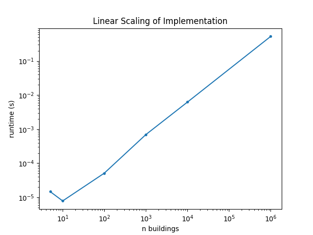
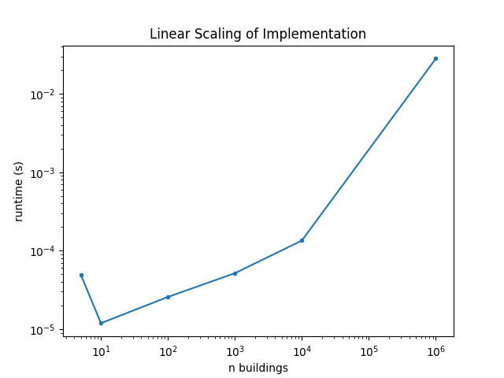

# Exercise 3

## Scalability Analysis
The algorithm as implemented in `calculator_1.py` under `potential_financial_losses_estimate` experiences linear scaling.

For a set of runs of varying size (n), we experience the following runtimes: 
n       |time(s)
---     |---
5       |1.2159347534179688e-05
10      |4.601478576660156e-05
100     |4.38690185546875e-05
1000    |0.0005209445953369141
10000   |0.00467681884765625
1000000 |0.53981614112854

The program is also linear in memory usage.

We note that running the proposed naieve solution on 1,000,000 buildsings in the given data format does not present a problem, but may be too time consuming for immediate user feedback.

## Optimization Strategies

1. Multiprocessing
The computations for each building are fully independent, meaning that they are "embarassingly parallel" and could be done all at the same time, rather than sequentially as our naieve implementation does.  One improvement for optimizing this code would be to evaluate buildings in parallel batches, with the size depending on the CPU in which the script is being run.  This can be done using a number of different frameworks, including asyncio, joblib, multiprocessing, etc...  In this paradigm, we can also manage the memory utilization by reading only once per batch, then controlling batch size to reduce the memory usage f required.

2. Vectorization
Another approach to improve the runtime here would be to vectorize the operations and instead use operations between arrays in numpy.  This in turn relies on lower-level C implementations of matrix operations, which tend to be far faster than python for-loops. One downside of this approach is it requires reading all data into memory at once.

## Resource Management

While scaling an algorithm like this, it is important to consider the resource usage by monitoring the memory use and processing power.  The exact method for doing so will depend on the platform, but most cloud providers have dashboards showing memory and CPU usage (for example, see [Google Cloud docs](https://cloud.google.com/kubernetes-engine/docs/how-to/view-observability-metrics#metrics_for_clusters_and_workloads) `CPU` and `Memory` and [AWS docs](https://docs.aws.amazon.com/AmazonCloudWatch/latest/monitoring/Container-Insights-metrics-EKS.html) `node_cpu_utilization` and `node_memory_utilization`).

As the number of buildings grows, the memory required will also grow if not kept in check.  One way to mitigate this is to use windowed reads and writes. By reading in the data in chunks then perform operations and append output to an existing file, you can strictly control the memory usage of the operation.

The examples detailed above for optimization can also be used to control memory and CPU.  For example, setting the size and number of parallel chunks can help control CPU utilization.

## Example Code
The vectorized example has been implemented [here](exercise4_example.py).

While it still seems to scale linearly, it runs in less than 5% of the time of the original algorithm.

For a set of runs of varying size (n), we experience the following runtimes: 

n       |time(s)
---     |---
5       |4.982948303222656e-05
10      |1.1920928955078125e-05
100     |2.574920654296875e-05
1000    |5.173683166503906e-05
10000   |0.00013494491577148438
1000000 |0.02812814712524414

